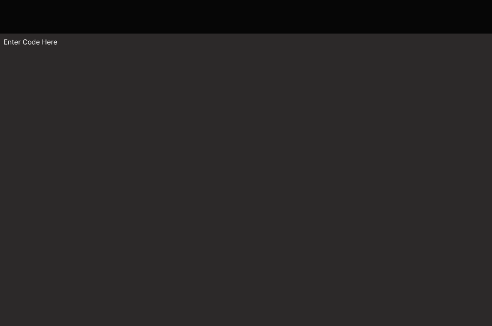
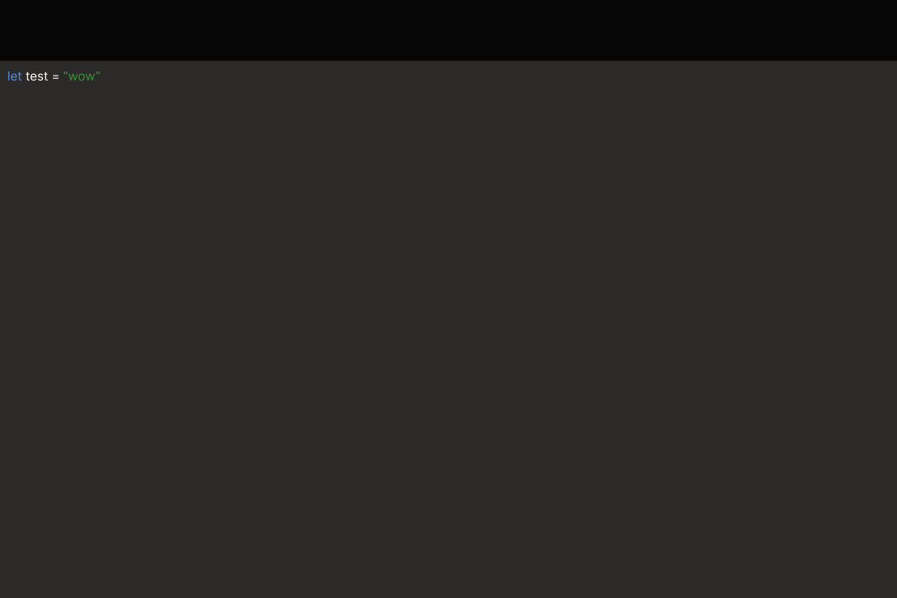
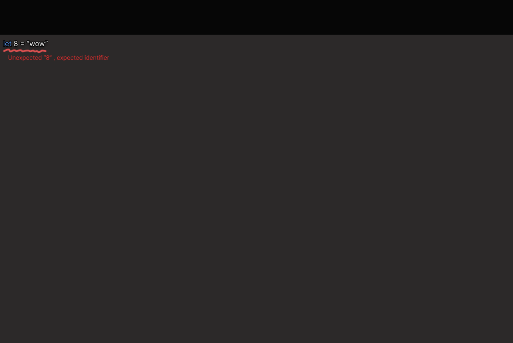
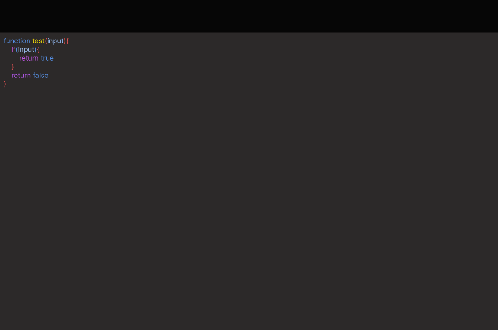
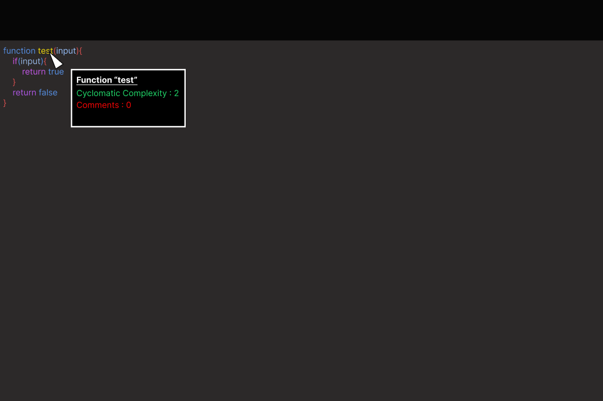
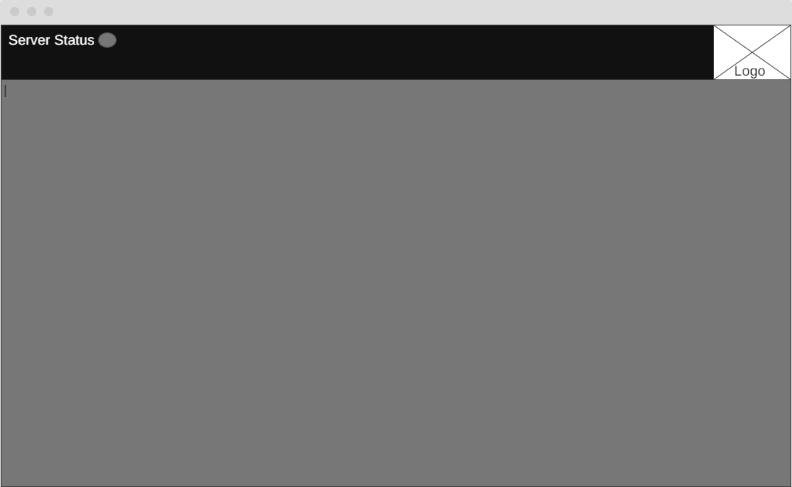
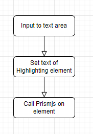

<center><font size="8">Development Diary</font></center>

---

<center><font size="4">Sprint 1</font></center>
<div style="text-align: right"> 31<sup>st</sup> January 2022</div>

**Planned Items**
- Interface
- Code tokenization
- Abstract Syntax Tree
- Cyclomatic Complexity
- Readability

19/02/2022:\
The first sprint was interrupted due to catching covid. This halted work from 06/02/2022.

This also delayed the starting of the second sprint from 14/02/2022 to 21/02/2022.

Despite this the first week of Sprint 1 had progress with

- Setting up the development environment
  - Node js server to run all logic
  - React Application front end
  - Testing with Jest
- Interface
  - Code entry interface


**Retrospective**


With the lost time I feel it is necessary to re-calibrate my user stories. I will be performing

1. MoSCoW Analysis
2. T-shirt sizing
3. Value/Risk
4. Creating Priorities from MoSCoW + Value/risk
5. Planning Poker

The actual development went well during the sprint, I believe the test driven development approach I am taking is making development go smoother. 

Next sprint I will attempt to log extra hours to make up for the development downtime this sprint, this will be factored in the planning stage. This will move budgeted time per week to approx 40 hours.

---

<center><font size="4">Sprint 2</font></center>
<div style="text-align: right"> 21<sup>st</sup> February  2022</div>

**Planning**

**Planned Items**
- As a user I want to be able to enter code into a graphical interface #19
- Code Duplication #15
- As a user I would like to see problems listed with appropriate descriptions #22
- Number of lines of code in class/method/file #11
- Number of parameters in a method #12
- Code Parser

28/02/2022:\

Sprint 2 week 2 delayed 1 week due to planning hackathon.

08/03/2022:\

I encountered a problem in week 1 that was the syntax highlighter was not playing ball with css importing.

```css
._1LxLbXOtVi04_ZTYVk3kpY,
._2F4SQjgk1woOFDEJwXf1ZS,
._1LxLbXOtVi04_ZTYVk3kpY,
.uKwXkKDWIkYds_vGUwFkJ, {
    color: #999
}
```
This is happening because the css loader is creating "random" identifiers for classnames to ensure unique styles are applied.

To remedy this I had to make a simple change within **/client/config/webpack.config.js**

```js
    const getStyleLoaders = (cssOptions, preProcessor) => {
            ...
                options: {
                    modules: cssOptions.module === "no-module" ? false : true
                }
            ...
```

I added a check to specify non modular css loading , our css will be loaded as is.


*Further down in the file*

```js
{
    test: cssRegex,
    exclude: cssModuleRegex,
    use: getStyleLoaders({
            importLoaders: 1,
            sourceMap: isEnvProduction && shouldUseSourceMap,
            module: "no-module"}),
    sideEffects: true
},
 ```
 ```js
 const cssRegex = /\.css$/;
 ```

 When encountering style importing of the type cssRegex, I pass this "no-module" string and any "*.css" file will be treated and imported as pure css.


 **Designs**

The inital designs 

 
 
 
 
 
  


Code editor explanation

I realised early that if I was to make a web application that it would be very important for code to be highlighted as it was entered, this is a standard for any code editor.

Using a website from my research into parsing [astexplorer.net](https://astexplorer.net/) for inspiration, the code editing portion should be as large as possible with space for information / controls on the top. This would allow for the layout to be consistent to the mobile layout.

Having tested the syntax highlighter [prism.js](https://prismjs.com/) and finding the node package [prismjs](https://www.npmjs.com/package/prismjs) which purpose is to highlight static code on a webpage [examples here](https://prismjs.com/#examples).

Although prismjs is perfect for highlighting code statically, I need the user to be able to edit the code and have it highlighted dynamically. Which is where my research lead me to an article written by [Oliver Geer on Apr 16, 2021](https://css-tricks.com/creating-an-editable-textarea-that-supports-syntax-highlighted-code/)

The idea is to have an invisible textarea over the statically highlighted element, with changes to the text area updating the highlighted element. I took this idea and created a [React.js](https://reactjs.org/) implementation 



```jsx
    <textarea
          ref={this.state.editingRef}
          placeholder="Enter Code Here "
          className={styles.editing}
          spellCheck="false"
          onChange={(ev) => {
            this.handleInput(ev);
          }}
          onScroll={(ev) => {
            this.handleScroll(ev);
          }}
          onKeyDown={(ev) => {
            this.handleKeyDown(ev);
          }}
        ></textarea>
        <pre
          ref={this.state.highlightingRef}
          className={styles.highlighting}
          aria-hidden="true"
        >
          <code className="language-javascript" id="highlighting-content">
            {this.state.text}
          </code>
```
The textarea element has event handlers attached [in the react fashion](https://reactjs.org/docs/handling-events.html) 

Both elements have [Refs](https://reactjs.org/docs/refs-and-the-dom.html) attached to allow them to be accessed throughout the React component


```js
handleInput(event) {
    event.persist(); // stops react from recycling the SyntheticEvent on re-render
    let text = this.state.editingRef.current.value;
    if (text[text.length - 1] == "\n") {
      text += " ";
    }
    this.setState({ text });
  }
```
When the onChange listener is fired on the textarea, the text from the text is set to state so we can access in our render function. We add an extra character to the text as a code block will ignore an empty line.


```jsx
<code className="language-javascript" id="highlighting-content">
    {this.state.text}
</code>
```
This is then used in the render function 

```js
componentDidUpdate() {
    setTimeout(() => Prism.highlightAll(), 0);
  }
```

[componentDidUpdate](https://reactjs.org/docs/react-component.html#componentdidupdate) is called by react when the component updates e.g. via a state update. So once we set the text we can call highlight on it.


```js
handleKeyDown(event) {
    if (event.key === "Tab") {
      event.preventDefault();
      this.handleTab();

      return;
    }

handleTab() {
    let text = this.state.text;

    let before = text.slice(0, this.state.editingRef.current.selectionStart);
    let after = text.slice(
      this.state.editingRef.current.selectionEnd,
      text.length
    );
   
    let cursor = this.state.editingRef.current.selectionStart + 1;
    console.log(cursor);
    
    let newText = before + "\t" + after;
    

    this.state.editingRef.current.value = newText;
    this.setState({ text: newText }, () =>this.state.editingRef.current.setSelectionRange(cursor, cursor));
  }
```

on a key event being fired we check if tab is the key pressed, if it is we cancel the tabbing by calling "event.preventDefault()"

We then get the cursor position and insert a tab between before and after the selection.

We set the state to the new text, starting the previous process again and then in the callback of [setState](https://reactjs.org/docs/react-component.html#setstate) we update the cursor position.


**Review**


The initial goal of the sprint was
- To make progress on the product backlog

Requirements that were contained within the sprint
- As a user I want to be able to enter code into a graphical interface #19
- Code Duplication #15
- As a user I would like to see problems listed with appropriate descriptions #22
- Number of lines of code in class/method/file #11
- Number of parameters in a method #12
- Code Parser

Requirements that were met during the sprint
- As a user I want to be able to enter code into a graphical interface #19

What went well or went poorly during the sprint
- Great progress was made on the code editor interface, I believe I overestimated how much I could do during the sprint.

Any adjustments that are going to be made moving forward
- Adjust the amount/focus of stories for the next sprint

Closing information about the next sprint
- Next sprint will be focused on getting user testing on the code editor and starting the analysis by creating a parser

---