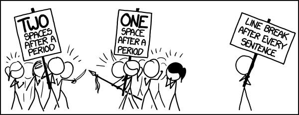

**Research Links**

***3 ways to measure code quality.[link](https://sourcelevel.io/blog/measuring-code-quality-3-suggestions-on-how-to-start-and-why-they-are-important)***

* Complexity Measures 
[link](https://camelcaseguy.medium.com/measuring-code-quality-qualitative-and-quantitative-3d6eeb633a90)
  * [Halstead Complexity Measures](https://en.wikipedia.org/wiki/Halstead_complexity_measures)
  * [Cyclomatic Complexity](https://en.wikipedia.org/wiki/Cyclomatic_complexity)
    * Invented by thomas J.McCabe [paper](http://www.literateprogramming.com/mccabe.pdf)
  * [Weighted Micro Function Points](https://en.wikipedia.org/wiki/Weighted_Micro_Function_Points)
  
* Code Smells [link](https://refactoring.guru/refactoring/smells)
  * The metric here is the absolute number of them found in your code. Very easy to calculate.
  * Can be found by 
    * [linters](https://sourcelevel.io/blog/what-is-a-linter-and-why-your-team-should-use-it) 
    * Code smell checkers
      * [interesting article](http://www.diva-portal.org/smash/record.jsf?pid=diva2%3A1458340&dswid=462)
* Security Issues

    Maybe not the best to investigate within this scope as students security issues may not be important unless within a specific module (database module) **CHECK THIS IN A QUESTIONNAIRE**

 ***More ways to measaure code complexity [link](https://se-education.org/learningresources/contents/codeQuality/CodeQualityMetrics.html)***

* Complexity Measures
  * NPath Complexity **NC**
    * [paper](https://dl.acm.org/doi/10.1145/42372.42379)
* Class Design Metrics
  * [The Chidamber and Kemerer Metrics](http://www.virtualmachinery.com/sidebar3.htm)
    * Weighted Methods per Class (WMC)
    * Coupling Between Objects (CBO)
    * Response For Class (RFC)
    * Lack of Cohesion of Methods (LCOM)
    * Depth of Inheritance Tree (DIT)
    * Number of Children (NOC)
* Seemingly Trivial Metrics
  * Number of lines of codes in a class/method/...
  * Number of methods in a class
  * Number of fields in a class
  * Number of parameters in a method
  * Nesting depth of a method
  * Code coverage
  * Percentage of comments
  * Percentage of code duplication
* Custom Metrics
  * [How to design a metric](https://www.developer.com/design/software-quality-metrics/)

*Readability and Code Formatting*

    Using proper indentation and formatting in the code makes the code more readable, according to the standard particular to that programming language in which you've written the code. Doing this makes the code structure more visible and consistent.

Some of the tips that can improve the readability of your code are:

* Document and comment on the code.
* Use a consistent indentation style throughout the code.
* Use consistent naming schemes like camelCase, PascalCase, snake_case, etc.
* Reduce the level of nesting improves code readability.

***Making sense of metrics***

Using metrics is nice but it has to acheive an outcome, ***without appropriate context it is merely a number***

* It makes little sense to say " This function has a *Cyclomatic Complexity **CC** of 42* , bad coder"
* It makes some sense to say " This function has a **CC** of 42" , That means we will need at least 42 test cases to get full branch coverage, this is bad"
* It makes the most sense to say: "This method has a **CC** value of 42. That means we need at least 42 test cases to achieve full branch coverage for it. This indicates an overly complex method, and it will be difficult to maintain in the long run. Try to separate it to calls of a few methods of **CC** value of 10 or less each; that way we can better design test cases for those smaller methods and achieve perfect coverage."
* 

***Code Quality Metrics Tools***

* Java: [PMD](https://pmd.github.io/)
* JavaScript: [ESLint](https://eslint.org/)
* C#: [Visual Studio Code Analysis](https://blogs.msdn.microsoft.com/zainnab/2011/05/17/code-metrics-cyclomatic-complexity/)
* Python: [radon](https://pypi.python.org/pypi/radon)
* Ruby: [RuboCop](https://batsov.com/rubocop/)
* PHP: [PHPMD](https://phpmd.org/)
---
***What is the problem with quantitising code quality***

The biggest problem is characterised by [Goodhart's Law](https://en.wikipedia.org/wiki/Goodhart%27s_law)
>"When a measure becomes a target, it ceases to be a good measure"

 [Strathern, Marilyn (1997). "'Improving ratings': audit in the British University system". European Review. John Wiley & Sons.](https://en.wikipedia.org/wiki/Goodhart%27s_law#cite_note-:2-1)

</img>

---

***How can these problems be fixed***
* [Refactoring Techniques](https://refactoring.guru/refactoring/techniques)
  * 

---

