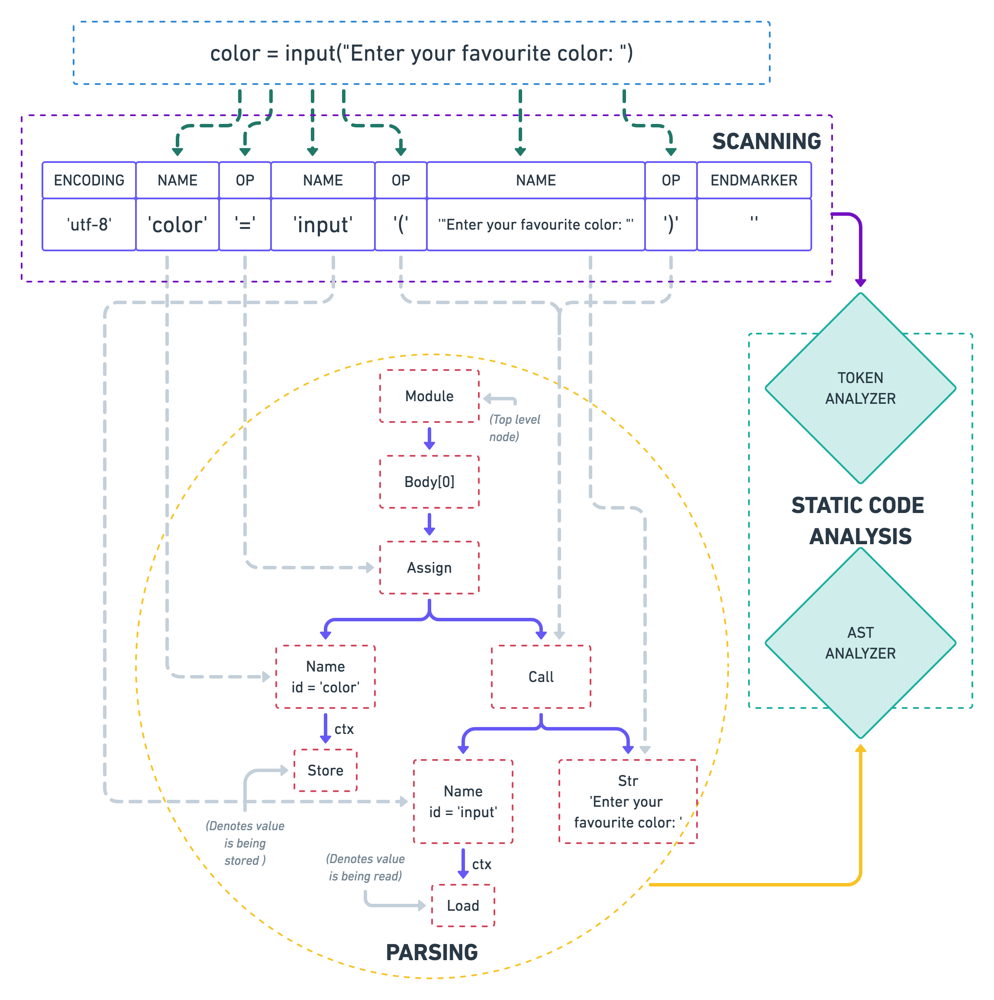
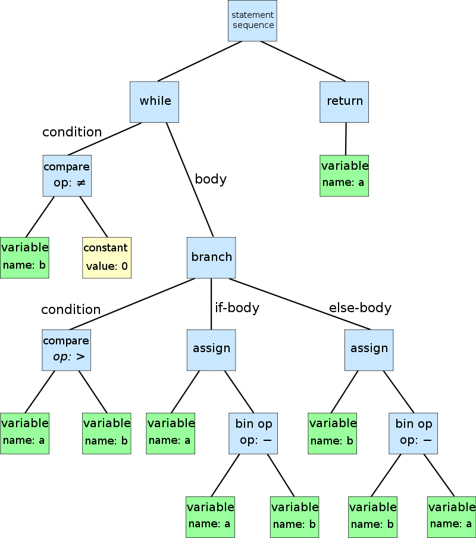

**Creating A Linter**

<p align="center" >

<p>

***Books***

> Secure Programming with Static Analysis (Addison-Wesley Software Security) 


***Articles***
> [technology behind static analysis tools](http://www.opensourceforu.com/2011/09/joy-of-programming-technology-behind-static-analysis-tools/)
: A look how the parts of a linter works

> [A hands-on introduction to static code analysis](https://deepsource.io/blog/introduction-static-code-analysis/)
: Incredible deep dive into creating 


---
***[AST (Abstract Syntax Tree)](https://medium.com/@dinis.cruz/ast-abstract-syntax-tree-538aa146c53b)***
```python
    while b ≠ 0
    if a > b
       a := a − b
    else
        b := b − a
    return a
```
<p align="center" >

<p>


---

> [perils of parsers **READ THIS**](https://www.semanticdesigns.com/Products/DMS/LifeAfterParsing.html)
